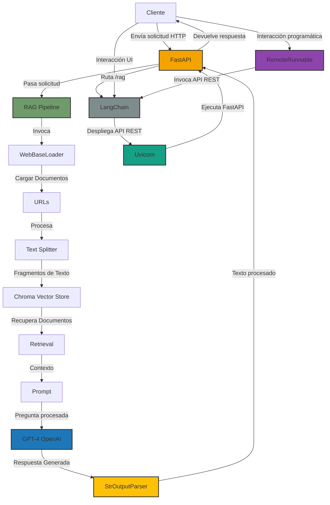
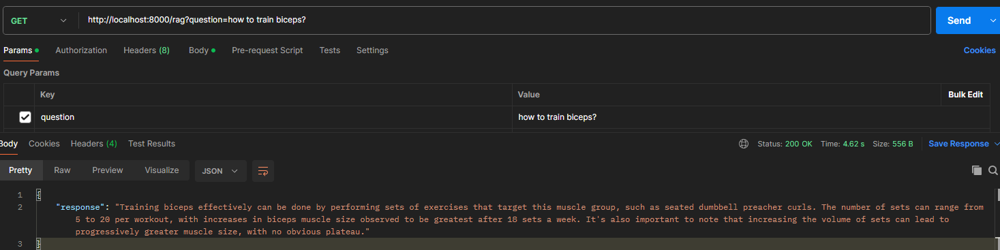

# AREP - Taller RAG
## Autor: David Leonardo Piñeros Cortés

El objetivo de este taller es construir un servidor RAG, el cual es un enfoque en el procesamiento de lenguaje natural que combina técnicas de recuperación de información con generación de texto. Su objetivo es mejorar la capacidad de los modelos de lenguaje, como GPT, para responder a preguntas complejas o generar textos más informados y precisos, utilizando información externa.

En este caso se utilizaron 17 artículos científicos sobre la ciencia de la hipertrofia y cómo entrenar determinados grupos musculares.

### Arquitectura

La arquitectura de la aplicación está basado en FastAPI y LangChain que implementa un modelo de Retrieval-Augmented Generation (RAG). FastAPI actúa como servidor web, exponiendo un único endpoint /rag que recibe una pregunta del usuario y devuelve una respuesta generada por el sistema. La API permite que el usuario consulte sobre información específica y obtenga respuestas contextuales y relevantes.

En el corazón de la aplicación está LangChain, una librería que facilita la integración de modelos de lenguaje con flujos de trabajo complejos de procesamiento de texto. Utiliza Chroma, una base de datos vectorial, para almacenar y recuperar documentos relacionados con la pregunta del usuario. Estos documentos se cargan desde URLs específicas utilizando WebBaseLoader y se dividen en fragmentos más pequeños mediante RecursiveCharacterTextSplitter para su indexación. Los fragmentos de texto se representan mediante OpenAIEmbeddings, que convierte los documentos en vectores que pueden ser recuperados eficientemente.

Cuando el usuario realiza una consulta, la pregunta se procesa junto con los documentos recuperados, utilizando GPT-4 (a través de ChatOpenAI) para generar una respuesta. LangChain conecta todos estos componentes en una cadena de procesamiento, que incluye la recuperación de documentos, la generación de texto y la post-procesamiento de la respuesta utilizando un StrOutputParser. Todo esto se orquesta mediante una cadena RAG que permite que el modelo aproveche la información recuperada para generar respuestas más precisas.



### Instalación y Ejecución
Para ejecutar la aplicación es necesario instalar Python 3.12.7 o versiones similares y git. El primer paso es clonar el repositorio e ingresar a la carpeta resultante

```
git clone https://github.com/leoncico/AREP-LAB08-PART2.git
````

A continuación debe editar el archivo RAGProyect.py en la linea 11 y 12 para ingresar la clave API de chatgpt y de LangChain (se indican cuales son las clave en comentario de entrega).

```
os.environ["OPENAI_API_KEY"] = "(clave api)"
os.environ["LANGCHAIN_API_KEY"] = "(clave api)"
```

Luego ingrese a la terminal y escriba los siguientes comandos (para windows):

```
python -m venv .venv
```

```
.venv\Scripts\activate
```

```
pip install -r requirements.txt
```

Una vez terminada la instalación de las dependencias puede ejecutar el servidor con:

```
python RAGServer.py
```

Finalmente pruebe el servidor enviando la query a la siguiente dirección con el formato indicado http://localhost:8000/rag?question=(Pregunta relacionada con el entrenamiento de hipertrofia)



Video del programa en funcionamiento: https://youtu.be/FM8VqoLLL0Q